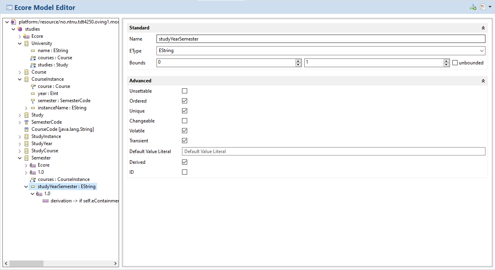
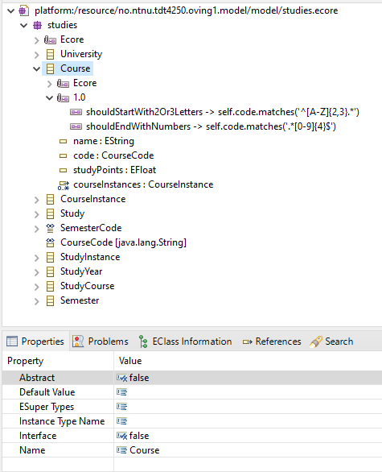
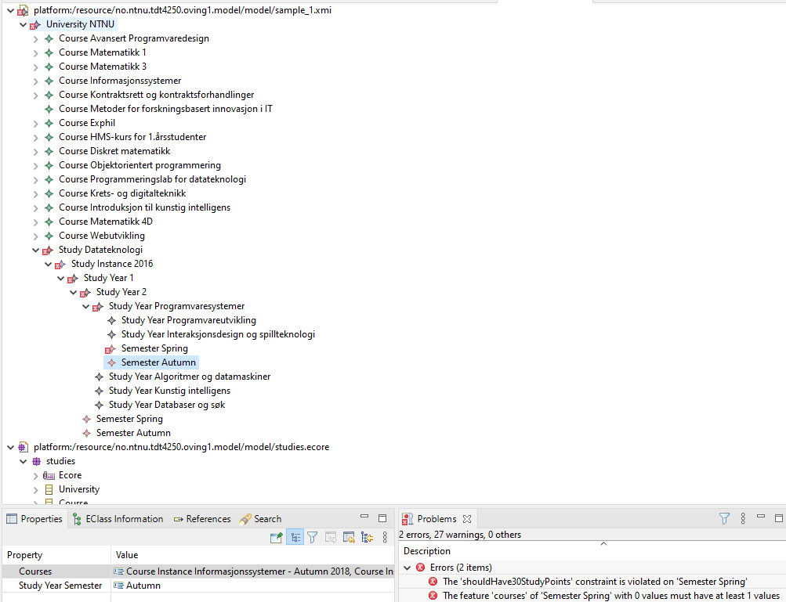
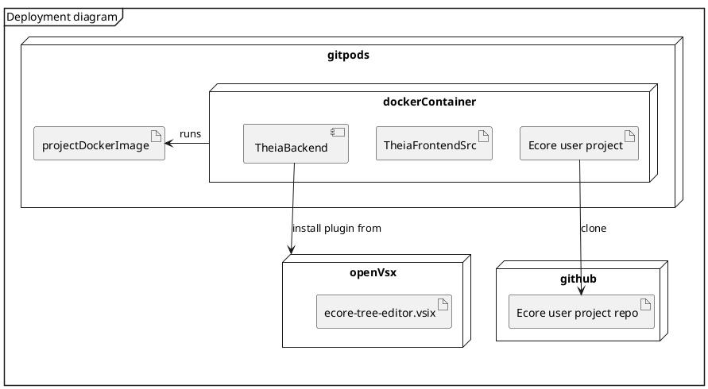
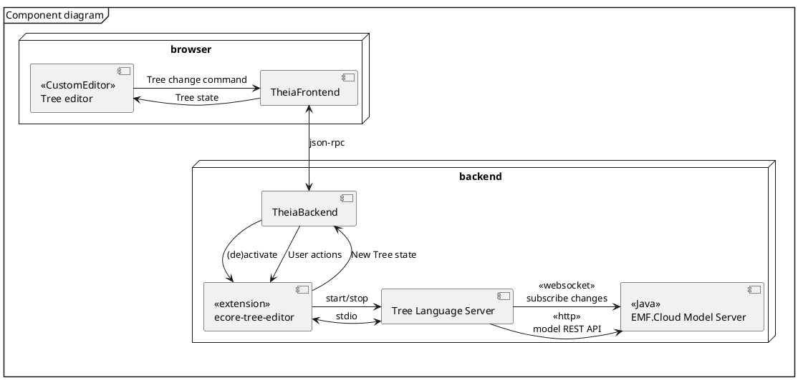
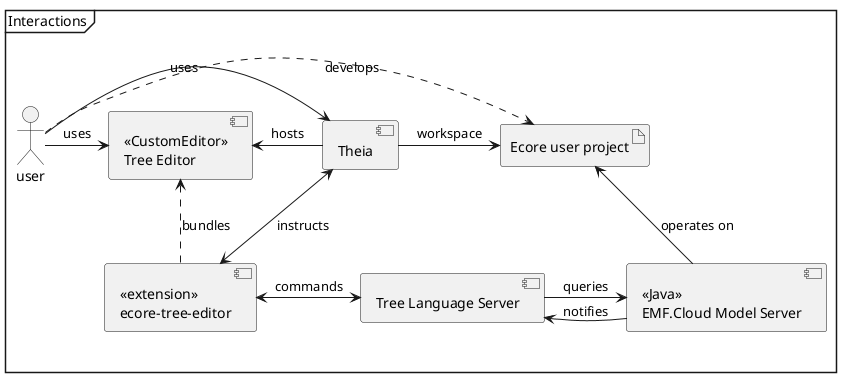

# Design Document

> [What is a design document?](https://www.industrialempathy.com/posts/design-docs-at-google/)

## Context and Scope

Ecore is a meta model inside the Eclipse Modeling Framework (EMF).
This meta model is used by developers to create domain models when practising Model-Driven Software Engineering (MDSE). An Ecore model can be visualized as a 
diagram similar to UML (like EcoreTools/Sirius), as a tree stucture or a raw XML-like file.

For editing Ecore in Theia, we already have the [ecore-glsp](https://github.com/eclipse-emfcloud/ecore-glsp). However, this is only a graph editor.
Another common way of editing Ecore is through a tree view + properties panel.

This project aims to implement a tree view editor for Ecore in Theia, 
and bundle as a VSCode extension (`.vsix`) that is installable in Gitpods.

### Reference implementations

Inspiration and guidance is drawn from the Eclipse implementations:
*Ecore Model Editor* and the *Sample Reflective Ecore Model Editor*.

Note that the *Sample Reflective Ecore Model Editor* can also edit model instances (`xmi`-files) and run OCL validations:

## Goals and non-goals

* Visualize Ecore models as trees
  * Package, datatype, class, attribute, annotation and annotation-values as nodes
  * Labels: name, icon, datatype
* Add and remove nodes in the tree
* Property sheet editor. Master-detail where tree=master and property=detail.
* Both meta-model (Ecore) and model instance (xmi)
* Automatically update when underlying model changes (push not poll)

> Non-goal: Things that could be goals, but we chose not to do them.

Most of these are non-goals due to time constraints, and could be in-scope for a finalized product.

Non-goals:
* Lazy load children for large models
* Handle dependencies to other models
* Drag-n-drop nodes
* Editable names in tree
* Custom labels (e.g. via OCL) for model instances (xmi)
* Customizable icons for model instances (xmi)
* OCL constraint validation for model instances (xmi)
* Live OCL evaluator for writing queries 

## Design and trade-offs

It will be a VSCode extension project in Typescript.
Using the VSCode extension API you can install the extension during runtime into a Theia instance. This is possibly needed for Gitpods (*assumption*).
A trade-off is that using Theia Extensions, you get full control. Here we are restricted to VSCode API and what subset of it Theia supports.

Using a VSCode extension, the text editor is limited to text. 
Thus we have to rely on a [Custom Editor API](https://code.visualstudio.com/api/extension-guides/custom-editors) to create arbitrary layouts.
(An alternative is  [WebView](https://code.visualstudio.com/api/extension-guides/webview) , but I don't know which API Theia will support first).
The Custom Editor API is essentially WebView+Document APIs.
These WebViews have special requirements for serializing state,
and restrictions for where they can load resources.

`CustomTextEditorProvider` or `CustomEditorProvider`? A `CustomEditorProvider` may be best.
A text based editor gets a document model for free, and related functionality like saving. If a tree can easily map to text editing, this could be beneficial. However, most changes to the document would not be performed by the editor, but the **model server**. The editor is mostly a model observer and change-command dispatcher; not an *editor* itself.

### System-context-diagram

### Degree of constraint

The project must work in Theia inside Gitpods.
Gitpods is the ultimate target.
However, **when** is an important question. Within 2 years from Jan/20201 is reasonable.
This timeframe allows for Theia to (maybe) support the CustomEditor or WebView VSCode APIs.

It should be an VSCode extension, but if Gitpods can load Theia Extensions, this constraint falls.

It may use EMF.Cloud's [EMF Model Server](https://github.com/eclipse-emfcloud/emfcloud-modelserver) if this simplifies model parsing or enhances tool/extension interoperability/cooperation among other extensions.

~~It should use [Theia Tree View](https://github.com/eclipse-emfcloud/theia-tree-editor) if this is possible to use in a VSCode extension.~~ (**Seems to not be possible.** It depends on Theia core and uses Theia Extension API).
- Alternatively, there is a [VSCode TreeView](https://github.com/microsoft/vscode-extension-samples/tree/master/tree-view-sample) for displaying trees in the Action Bar (e.g. the workspace file explorer). Its freedom (icons, right click actions etc) may be limited (*assumption*).
- https://github.com/mar10/fancytree 
- https://www.jstree.com/

It should use [JSON Forms](https://jsonforms.io/) for the detail view.
This supports React and Angular.

## Alternatives considered

* [VSCode Custom Editor API](https://code.visualstudio.com/api/extension-guides/custom-editors)
  * This uses APIs [not supported](https://che-incubator.github.io/vscode-theia-comparator/status.html) in Theia (*yet*)
    * `window.registerCustomEditorProvider`
* [WebView](https://code.visualstudio.com/api/extension-guides/webview)
  * This uses APIs [not supported](https://che-incubator.github.io/vscode-theia-comparator/status.html) in Theia (*yet*)
    * `window.createWebviewPanel`
  * Prefer custom editor over this
* [EMF Forms](https://www.eclipse.org/ecp/emfforms/). This seems to be a full editor on the web. 
  If this could be set to target the Ecore metamodel itself, and then be embeded in VSCode WebView/CustomEditor,
  * [Tutorial](https://eclipsesource.com/blogs/tutorials/getting-started-with-EMF-Forms/).
  * It uses [Remote Application Platform (RAP)](https://eclipsesource.com/blogs/tutorials/emf-forms-renderer/#rap) to render on web.
  * The Eclipse `Ecore Editor` from EMFForms is derivated from [GenericEditor](https://git.eclipse.org/c/emfclient/org.eclipse.emf.ecp.core.git/tree/bundles/org.eclipse.emfforms.editor/src/org/eclipse/emfforms/spi/editor/GenericEditor.java).
* [EMF Forms Tree Master Detail](https://eclipsesource.com/blogs/tutorials/emf-forms-view-model-elements/#treemasterdetail) used in EMF Forms.
